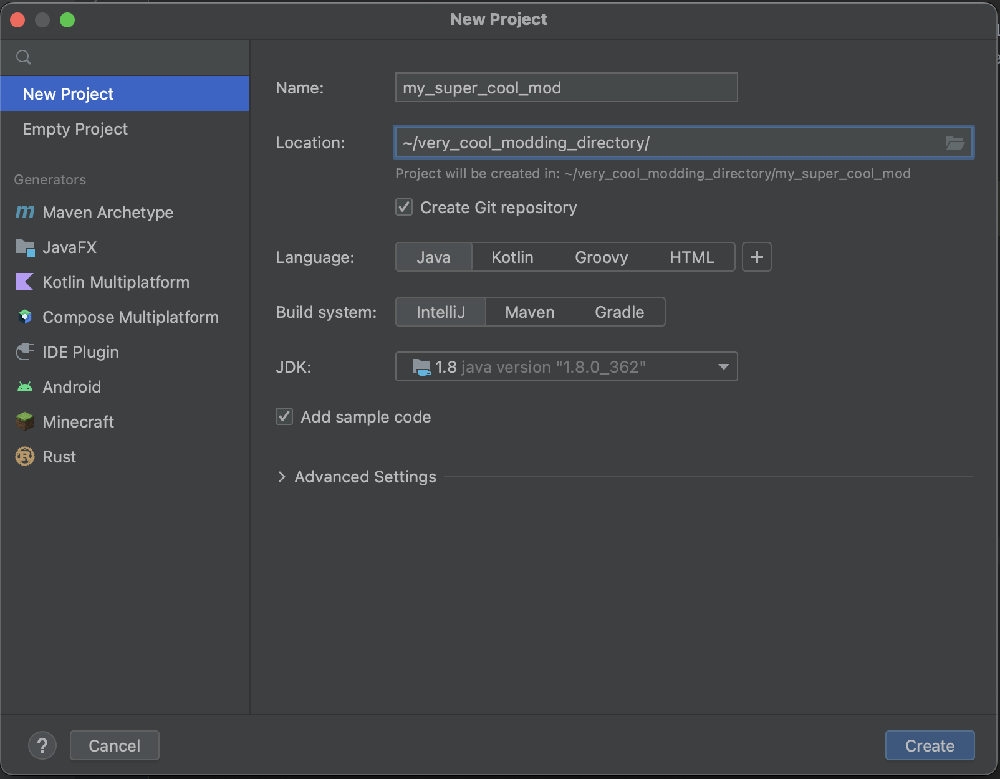

# Setting up your development environment to have waveAPI
Maven repository:
```groovy
maven {
    url "https://maven.waveapi.org"
}
```
Implementation:
```groovy
implementation "org.waveapi:API:1.0-SNAPSHOT"
```

If you know what you are doing, be free to skip examples on how to set this up.
## Here are some examples of how you can set up your build environment:
### IntelliJ IDEA with gradle (Recommended):
- Create a new project using gradle as your build system. (Recommended that you disable sample code, but you can just delete it later on)
   <p>
- Now that you have created your project you need to open `build.gradle` file and then add the maven repository for waveAPI to there. you can do that by pasting 
  ```groovy
    maven {
        url "https://maven.waveapi.org"
    }
  ```
  inside of `repositories {}` next to `mavenCentral()`. <br>
  Next you would want to actually include the library itself in your project, you can do that by adding `implementation "org.waveapi:API:1.0-SNAPSHOT"` inside of `dependencies {}` <p>
- Your final build.gradle should look something like:
  ```groovy
  plugins {
    id 'java'
  }

  group 'org.waveapi'
  version '1.0-SNAPSHOT'

  repositories {
    maven {
      url "https://maven.waveapi.org"
    }
  }

  dependencies {
    implementation "org.waveapi:API:1.0-SNAPSHOT"
  }
  ```
   <p>
- You are done now and can go onto the next chapter however you might want to make building your jar send it straight to your mod folder.  <p>
- For that you can add the following piece of code to your build.gradle
  ```groovy
  def dir = getProperties().get('dir')

  task copyJar(type: Copy) {
    from jar
    into dir
  }
  ```
   <p>
- Next you want to edit your run configuration.
  <p>
- Next you want to add a new run configuration and in run write `copyJar -Pdir=path/to/your/mods/folder` replacing `path/to/your/mods/folder` with a path to your mod folder:<br>

  <p>
- And now when you run that run configuration it will automatically copy the jar to your mods folder!  <p>


### IntelliJ IDEA without gradle or maven (not recommended):
- Create a new project using IntelliJ as your build system. (Recommended that you disable sample code, but you can just delete it later on)
  <p>
- Download the API jar from [https://maven.waveapi.org](https://maven.waveapi.org). you will have to go to https://maven.waveapi.org/org/waveapi/API/, find the most recent version and then find the most recent jar file there.

  <p>
- Now place that jar somewhere where you won't move it, you can place it in the folder with your super cool mod (you are also free to rename the API jar).  <p>
- Now go into your super cool mod's project structure
  <p>
- And add the API jar as a library
  <p>
- Next you want to create ability to export your mod as artifact, first create a new empty jar artifact and then drag "'(your mod's name)' compiled output" into the jar file. It is also recommended that you change your artifacts location to your mods folder


  <p>
- Now you can build your mod by pressing Build -> Build Artifacts -> Your artifact. Which is slow and not ideal, but it does work.  <p>