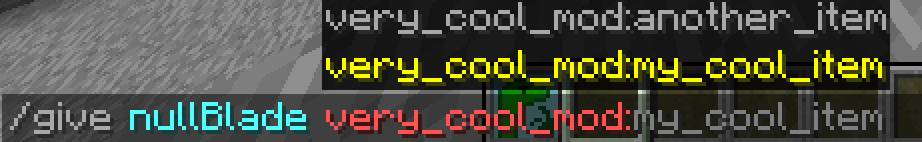
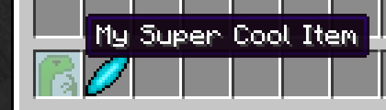

# Creating an item
It is recommended that to create an item you create a new java file for every item.
```java
public class CoolItem extends WaveItem {
    public CoolItem() {
        super("my_cool_item", CoolMod.getInstance());
    }
}
```
This 5 lines of code is enough to create an untextured item however no one wants an untextured item called `item.cool_mod.my_cool_item` so let's add a texture and a `en_us` name to it. We will use the following image as the texture
 by dragging it into a folder in the resource folder called `cool_mod/` and naming it `cool_item.png` so that I had a resource `cool_mod/cool_item.png`.
Next I need to signify that in the code by adding the following line in the item's constructor
```java
setModel(new SimpleItemModel("cool_mod/cool_item.png"));
```
so the code for our item will look like:
```java
public class CoolItem extends WaveItem {
    public CoolItem() {
        super("my_cool_item", CoolMod.getInstance());
        setModel(new SimpleItemModel("cool_mod/cool_item.png"));
    }
}
```
In this case setModel() takes in an ItemModel and as the ItemModel we give it a new instance of SimpleItemModel which we create from our item texture png file. <p>

Next we want to add `en_us` translation to our file.
We can add it using
```java
addTranslation("en_us", "My Super Cool Item");
```
so the final code will look like:
```java
public class CoolItem extends WaveItem {
    public CoolItem() {
        super("my_cool_item", CoolMod.getInstance());
        setModel(new SimpleItemModel("cool_mod/cool_item.png"));
        addTranslation("en_us", "My Super Cool Item");
    }
}
```
Now the only thing left is to create a new instance of CoolItem. We can do that by just creating a new instance of the item in the our mod's init() method, so it would look something like:
```java
@Override
public void init() {
    log.log("Hello, Minecraft!");
    new CoolItem();
}
```

alternatively we can also register a new item without actually creating a file for it using:
```java
new WaveItem("another_item", this)
                .setModel(new SimpleItemModel("cool_mod/another_item.png"))
                .addTranslation("en_us", "Another Item");
```
You can use that if you are just trying to register some resource item however 1 file per item is the recommended approach.
<br>
Now if we launch the game we should see that we can now give those items to ourselves using /give

